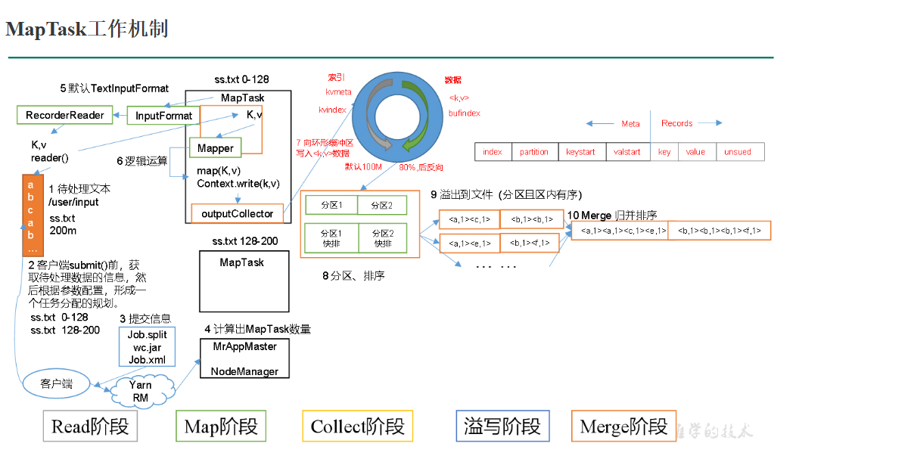

# MapTask工作机制
https://www.cnblogs.com/shihongpin/p/18419934

### 0. 准备阶段
submit提交前先获取分片大小`computeSplitSize(Math.max(minSize,Math.min(maxSize,blocksize)))=blocksize=128M`
根据分片大小**虚拟拆分**文件，不会实际拆分hdfs中存储的文件
准备jar包、xml文件和切片信息提交到yarn
MrAppMaster根据切片信息计算maptask数量

### 1. Read阶段  
MapTask通过InputFormat获得的RecordReader，从输入InputSplit中解析出一个个key/value。

### 2. Map阶段  
该节点主要是将解析出的key/value交给用户编写map()函数处理，并产生一系列新的key/value。

### 3. Collect收集阶段  
在用户编写map()函数中，当数据处理完成后，一般会调用`OutputCollector.collect()`输出结果。在该函数内部，它会将生成的key/value分区（调用`Partitioner`），并写入一个环形内存缓冲区中。

### 4. Spill阶段  
即“溢写”，当环形缓冲区满后，MapReduce会将数据写到本地磁盘上，生成一个临时文件。需要注意的是，将数据写入本地磁盘之前，先要对数据进行一次本地排序，并在必要时对数据进行合并、压缩等操作。

**溢写阶段详情**：  
1. **排序操作**  
   - 利用快速排序算法对缓存区内的数据进行排序  
   - 排序方式：先按照分区编号`Partition`排序，然后按照`key`排序  
   - 结果：数据以分区为单位聚集，且同一分区内所有数据按`key`有序  

2. **写入临时文件**  
   - 按分区编号由小到大依次写入任务工作目录下的临时文件`output/spillN.out`（N表示当前溢写次数）  
   - 若用户设置了`Combiner`，则在写入前对每个分区的数据进行一次聚集操作  

3. **元信息记录**  
   - 将分区数据的元信息写入内存索引数据结构`SpillRecord`  
   - 元信息包括：临时文件中的偏移量、压缩前/后数据大小  
   - 若内存索引大小超过1MB，则将其写入文件`output/spillN.out.index`中  

### 5. Merge阶段  
当所有数据处理完成后，MapTask对所有临时文件进行一次合并，以确保最终只会生成一个数据文件。

**合并过程**：  
- **最终文件生成**  
  - 所有临时文件合并成一个大文件`output/file.out`  
  - 同时生成索引文件`output/file.out.index`  

- **分区合并策略**  
  - 以分区为单位进行合并  
  - 采用多轮递归合并方式：  
    1. 每轮合并`mapreduce.task.io.sort.factor`（默认10）个文件  
    2. 产生的文件重新加入待合并列表  
    3. 对文件排序后重复上述过程，直到生成一个大文件  

- **优化目的**  
  - 避免同时打开大量文件  
  - 减少读取大量小文件产生的随机读取开销  